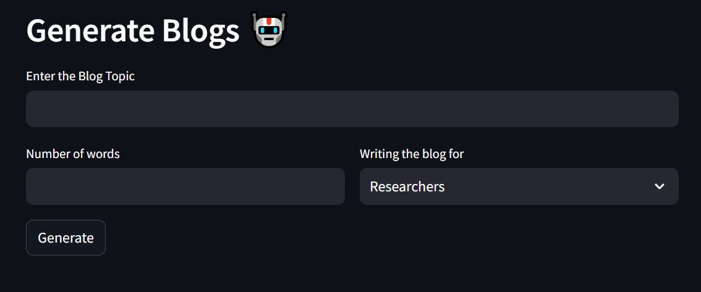
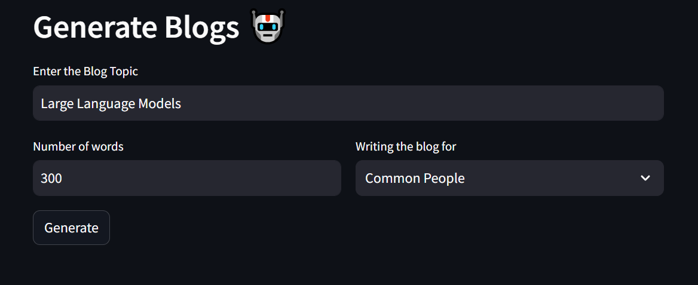
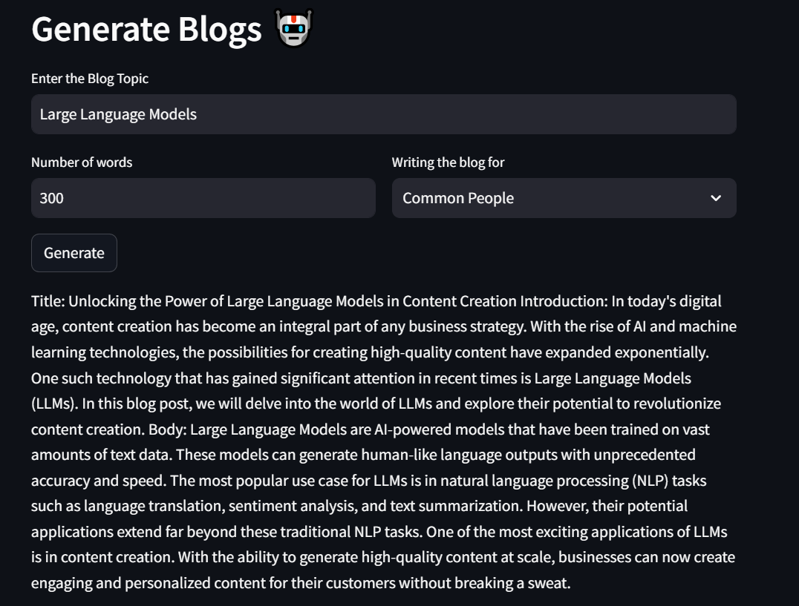

Blog Generator

The project aims to automatically generate blog using Llama2 model.

Image 1: Represents the developed user interface, showcasing the design and layout.

Image 2: Depicts the input given by the user.

Image 3: Illustrates blog generated by the application based on the user's input.
